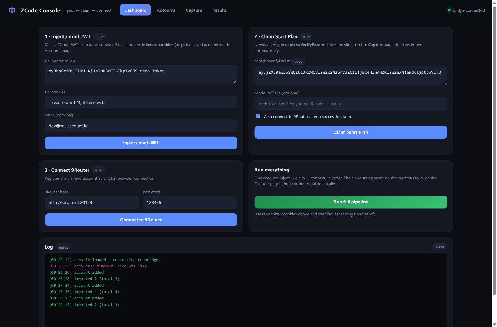
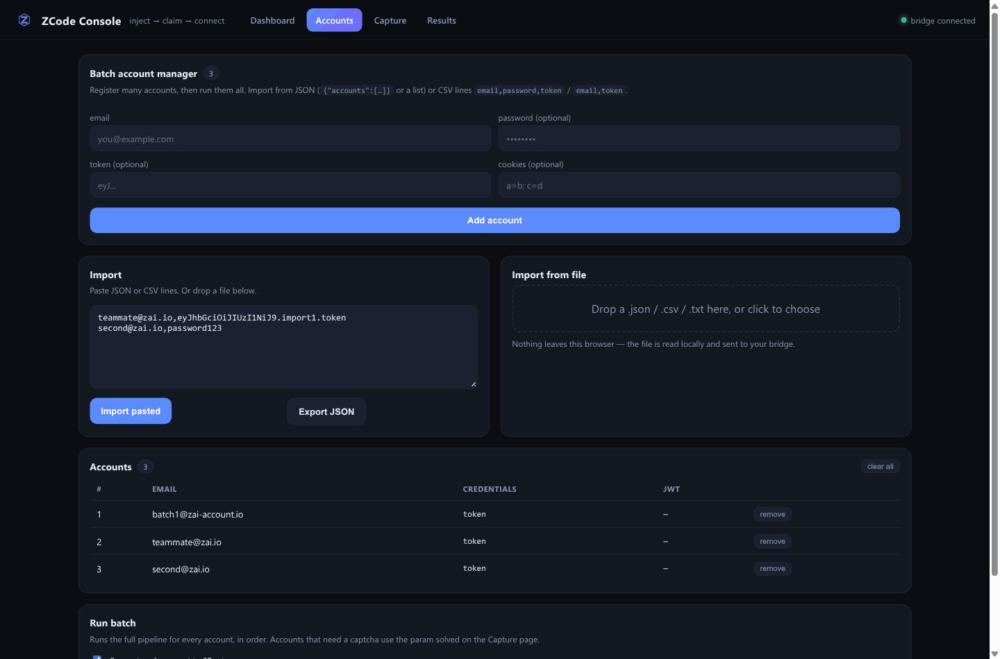
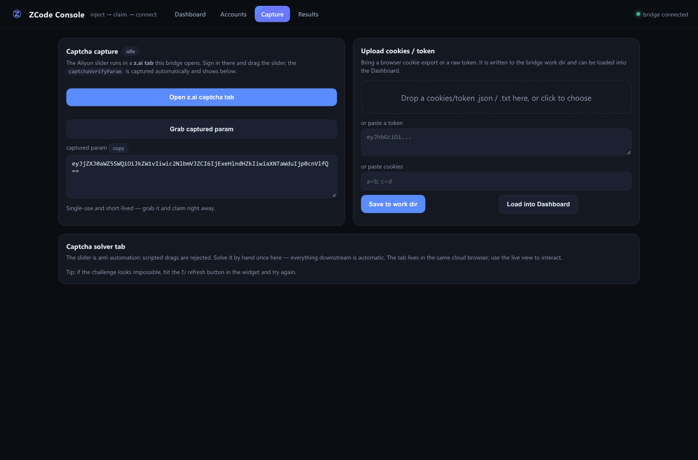
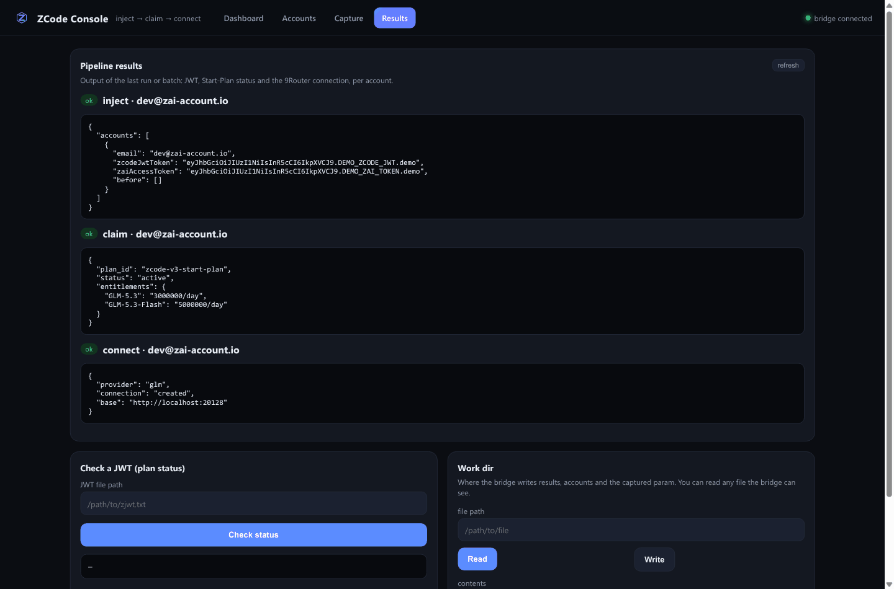
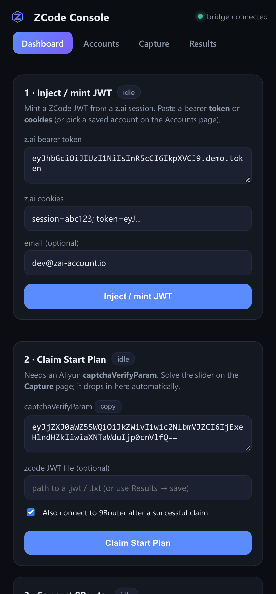

<div align="center">


# ZCode Claim · 9Router Pipeline

**Take an existing z.ai account → mint a ZCode JWT → claim the free Start Plan → connect GLM to 9Router.**

[](LICENSE)
[](https://www.python.org/)
[](https://9router.com)
[](#architecture)
[](CONTRIBUTING.md)

[English](README.md) · [Indonesia](docs/README.id.md) · [中文](docs/README.zh.md) · [日本語](docs/README.ja.md) · [Español](docs/README.es.md)

</div>

---

## Web UI console

The whole pipeline runs from a **full web console** that the bridge injects into
your browser — no terminal, no ports, no tunnels. Four pages: **Dashboard**,
**Accounts**, **Capture**, **Results**.

<p align="center">
  <br>
  <em>Dashboard — inject → claim → connect, plus a one-click “Run full pipeline”.</em>
</p>

<p align="center">
  
  <br>
  <em>Batch account manager (add / import JSON / CSV / export) and the captcha +
  credential upload page.</em>
</p>

<p align="center">
  
  <br>
  <em>Results viewer with JWT / Start-Plan status / 9Router connection, and a
  responsive mobile layout.</em>
</p>

### ▶ Demo video

A full walkthrough of the console (Dashboard → Accounts → Capture → Results):

[`docs/demo.mp4`](docs/demo.mp4) — 20 s, 1280×720.

> The demo uses mock data, so no real credentials appear.

### Features

| Page | What it does |
|------|--------------|
| **Dashboard** | Token/cookies → JWT, claim, connect, and a one-click **Run full pipeline** with a progress bar and live log. |
| **Accounts** | Add accounts, import from **JSON / CSV / file drop**, export, remove, and **run a batch** through the whole pipeline. |
| **Capture** | Opens the z.ai captcha tab, **auto-captures** the `captchaVerifyParam`, and uploads cookies/token files. |
| **Results** | Per-stage JSON results, JWT plan-status check, and a small file read/write against the work dir. |

Everything persists to `localStorage` (inputs survive a reload), and the bridge
writes state to a `console_data/` work dir next to the source.

## How this is

A small, dependency-light toolkit that automates the **ZCode** free-trial
("Start Plan") workflow and wires the result into **9Router** as a `glm`
provider pool. It is the automation counterpart to the official ZCode desktop
app: everything the app does through its UI, this does through its HTTP APIs and
a CDP-controlled Chromium.

> Reverse-engineered from **ZCode 3.14.4** (`ZCode-3.14.4-linux-x64.AppImage` →
> `resources/app.asar` → `out/host/index.js`, `out/renderer/assets/*`).

### The free Start Plan

| Entitlement | Free quota |
|-------------|-----------|
| **GLM-5.3**       | **3,000,000 tokens / day** |
| **GLM-5.3-Flash** | **5,000,000 tokens / day** |

`plan_id = "zcode-v3-start-plan"`. Without it, only the flash models
(`glm-4.5-flash`, `glm-4.7-flash`, `glm-4.6v-flash`) are free and the flagship
**GLM-5.3 returns `1113 Insufficient balance`**.

## Pipeline

```
z.ai token / cookies ──▶ OAuth consent ──▶ ZCode JWT ──▶ claim Start Plan ──▶ mint plan key ──▶ 9Router (glm)
      inject.py            chat.z.ai       zcode.z.ai        billing/claim        zauth.py      connect_9router.py
```

| Stage | Status |
|-------|--------|
| Inject token/cookies → ZCode JWT | ✅ verified |
| Claim Start Plan (Aliyun Captcha 2.0 gate) | ⚠️ needs an interactive solve |
| Mint z.ai coding-plan API key | ✅ verified |
| Register key into 9Router `glm` pool | ✅ verified against a mock 9Router |

## Two ways to run it

### 1. Web UI console (recommended)

The launcher installs the two light deps, then injects the console into your
browser and keeps it live:

```bash
./run.sh "$BU_CDP_WS"          # or: ./run.sh wss://<host>/devtools/browser/<id>
```

Prefer manual? The equivalent is:

```bash
python src/console_bridge.py --cdp "$BU_CDP_WS"
```

Open the browser's live view and drive the four pages:

1. **Dashboard** — paste a z.ai token/cookies → *Inject / mint JWT* → claim → connect,
   or hit **Run full pipeline** in one click.
2. **Accounts** — register many accounts and **run a batch** through the pipeline.
3. **Capture** — *Open z.ai captcha tab*, sign in and solve the slider; the
   `captchaVerifyParam` is captured automatically. Upload cookies/token files here too.
4. **Results** — inspect each stage's JSON, check a JWT's plan status.

### 2. CLI orchestrator

```bash
# inject a token, mint the JWT, submit a human-solved captcha, connect 9Router
python src/zcode_claim.py --cdp "$BU_CDP_WS" --email me@x.com --token eyJ... \
    --captcha-param '<param>' --connect --base http://localhost:20128

# batch of accounts → register every key into the glm pool
python src/zcode_claim.py --cdp "$BU_CDP_WS" --accounts accounts.json \
    --connect --base http://localhost:20128 --out claimed.json

# check a JWT you already hold
python src/zcode_claim.py --jwt-file zjwt.txt --status
```

## Requirements

- Python 3.9+
- `websockets` (for the console bridge) and `playwright` (for browser-driven steps)
- A Chromium reachable over CDP (e.g. a Browser Use cloud browser via `$BU_CDP_WS`)

```bash
pip install websockets playwright
```

## Repository layout

```
zcode-claim-9router/
├── assets/            logo + banner (svg + png)
├── docs/              README translations (id, zh, ja, es), STRUCTURE.md,
│   ├── screenshots/   console screenshots used in the READMEs
│   └── demo.mp4       console demo video
├── examples/          sample account / config files
├── src/               the toolkit
│   ├── inject.py          token/cookies → zcode OAuth → JWT
│   ├── claim.py           Aliyun captcha + billing/claim
│   ├── zauth.py           z.ai coding-plan API-key minting
│   ├── connect_9router.py register a key as a glm connection
│   ├── zcode_claim.py     CLI orchestrator
│   ├── solverify.py       third-party Aliyun solver client
│   ├── console.html       Web UI console (4 pages)
│   └── console_bridge.py  CDP bridge + RPC backend for the console
├── run.sh             one-command launcher (auto-start the bridge)
├── CONTRIBUTING.md
├── LICENSE
└── README.md
```

See [`docs/STRUCTURE.md`](docs/STRUCTURE.md) for the full component diagram.

## The captcha wall (please read)

The `billing/claim` call is gated by **Aliyun Captcha 2.0** (scene `11xygtvd`,
prefix `no8xfe`, region `sgp`). The server demands a **signed, interactive**
`captchaVerifyParam` produced *inside z.ai's own page*:

- A third-party solver (Solverify) returns a genuine solve, but in the
  **unsigned** shape and without the page-session binding → the claim rejects it
  (`3007` / `3001`).
- Scripted drags of the SDK slider are **silently rejected** regardless of
  accuracy (behavioural detection).
- Therefore the claim step expects a real interactive solve. The Web UI console
  exists to make that single step painless: solve once in the z.ai tab and the
  param flows through automatically.

## Responsible use

- Claiming trial quota through automation **breaches z.ai's Terms of Service**.
  Run this only on accounts you own, and know the risk.
- The Start Plan is **one per account and one-time**; a used plan cannot be
  re-claimed.
- `billing/claim` **rate-limits** (HTTP 429) — space out attempts.

## License

[MIT](LICENSE) © 0xgetz
