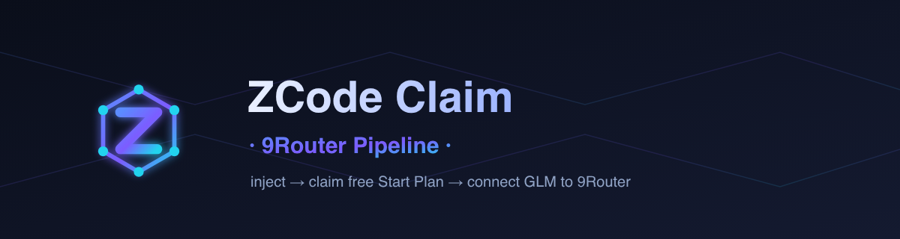

<div align="center">



# ZCode Claim · 9Router Pipeline

**用已有 z.ai 账号 → 铸造 ZCode JWT → 领取免费 Start Plan → 将 GLM 接入 9Router。**

[](../LICENSE)
[](https://www.python.org/)
[](https://9router.com)
[](#架构)
[](../CONTRIBUTING.md)

[English](../README.md) · [Indonesia](README.id.md) · **中文** · [日本語](README.ja.md) · [Español](README.es.md)

</div>

---

## 这是什么

一个依赖极少的轻量工具包,自动化 **ZCode** 免费试用("Start Plan")流程,并把结果
接入 **9Router** 的 `glm` 提供商池。它是官方 ZCode 桌面应用的自动化版本:应用通过
UI 完成的一切,本工具通过其 HTTP API 和受 CDP 控制的 Chromium 完成。

> 逆向自 **ZCode 3.14.4**(`ZCode-3.14.4-linux-x64.AppImage` →
> `resources/app.asar` → `out/host/index.js`、`out/renderer/assets/*`)。

### 免费的 Start Plan

| 权益 | 免费额度 |
|------|----------|
| **GLM-5.3**       | **3,000,000 token / 天** |
| **GLM-5.3-Flash** | **5,000,000 token / 天** |

`plan_id = "zcode-v3-start-plan"`。没有它,只有 flash 模型
(`glm-4.5-flash`、`glm-4.7-flash`、`glm-4.6v-flash`)免费,旗舰
**GLM-5.3 会返回 `1113 Insufficient balance`**。

## 流程

```
z.ai token / cookies ──▶ OAuth 授权 ──▶ ZCode JWT ──▶ 领取 Start Plan ──▶ 铸造 plan key ──▶ 9Router (glm)
      inject.py          chat.z.ai       zcode.z.ai       billing/claim        zauth.py      connect_9router.py
```

| 阶段 | 状态 |
|------|------|
| 注入 token/cookies → ZCode JWT | ✅ 已验证 |
| 领取 Start Plan(阿里云验证码 2.0 关卡) | ⚠️ 需交互式求解 |
| 铸造 z.ai coding-plan API key | ✅ 已验证 |
| 将 key 注册进 9Router `glm` 池 | ✅ 已对模拟 9Router 验证 |

## 两种运行方式

### 1. Web UI 控制台(推荐)

一个可点击的仪表盘会被注入到云浏览器;其按钮通过同一条 CDP 会话驱动流程
—— 无需端口,无需隧道。

```bash
python src/console_bridge.py --cdp "$BU_CDP_WS"
```

打开浏览器实时视图。**ZCode Pipeline Console** 让你:

1. **Inject** — 粘贴 z.ai bearer token 和/或 cookies → *Inject / mint JWT*。
2. **Claim** — *Open z.ai captcha tab*,完成滑块;`captchaVerifyParam`
   会自动捕获 → *Claim Start Plan*。
3. **Connect** — 填写 9Router base/password → *Connect to 9Router*。

### 2. CLI 编排器

```bash
# 注入 token、铸造 JWT、提交人工求解的验证码、连接 9Router
python src/zcode_claim.py --cdp "$BU_CDP_WS" --email me@x.com --token eyJ... \
    --captcha-param '<param>' --connect --base http://localhost:20128

# 批量账号 → 将每个 key 注册进 glm 池
python src/zcode_claim.py --cdp "$BU_CDP_WS" --accounts accounts.json \
    --connect --base http://localhost:20128 --out claimed.json

# 查看你已有的 JWT
python src/zcode_claim.py --jwt-file zjwt.txt --status
```

## 环境要求

- Python 3.9+
- `websockets`(控制台桥接)与 `playwright`(浏览器驱动步骤)
- 可通过 CDP 访问的 Chromium(例如通过 `$BU_CDP_WS` 的 Browser Use 云浏览器)

```bash
pip install websockets playwright
```

## 仓库结构

```
zcode-claim-9router/
├── assets/            徽标 + 横幅(svg + png)
├── docs/              README 译文(id、zh、ja、es)+ STRUCTURE.md
├── examples/          示例账号 / 配置文件
├── src/               工具包
│   ├── inject.py          token/cookies → ZCode OAuth → JWT
│   ├── claim.py           阿里云验证码 + billing/claim
│   ├── zauth.py           铸造 z.ai coding-plan API key
│   ├── connect_9router.py 将 key 注册为 glm 连接
│   ├── zcode_claim.py     CLI 编排器
│   ├── solverify.py       第三方阿里云求解器客户端
│   ├── console.html       Web UI 仪表盘
│   └── console_bridge.py  仪表盘的 CDP 桥接
├── CONTRIBUTING.md
├── LICENSE
└── README.md
```

完整组件图见 [`docs/STRUCTURE.md`](STRUCTURE.md)。

## 验证码关卡(请务必阅读)

`billing/claim` 受 **阿里云验证码 2.0** 保护(scene `11xygtvd`、prefix
`no8xfe`、region `sgp`)。服务器要求一个**已签名、交互式**的
`captchaVerifyParam`,且必须在 *z.ai 自己的页面内* 生成:

- 第三方求解器(Solverify)能给出真实解答,但形式是**未签名**且缺少页面会话
  绑定 → claim 拒绝它(`3007` / `3001`)。
- 脚本拖动 SDK 滑块无论多准确都会被**静默拒绝**(行为检测)。
- 因此 claim 步骤需要一个真实的交互式求解。Web UI 控制台正是为了让这一步
  轻松:在 z.ai 标签页解一次,参数即自动流转。

## 负责任地使用

- 通过自动化领取试用额度**违反 z.ai 服务条款**。仅在你拥有的账号上运行,并
  了解风险。
- Start Plan **每账号一次、仅一次**;已使用的 plan 无法重复领取。
- `billing/claim` 会**限流**(HTTP 429)—— 请在各次尝试之间留出间隔。

## 许可证

[MIT](../LICENSE) © 0xgetz
