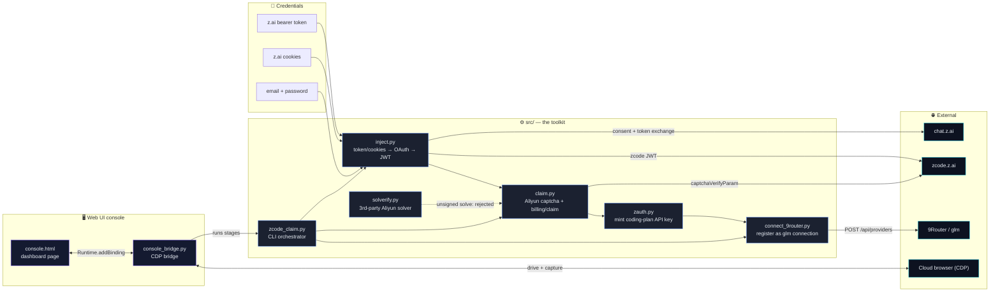
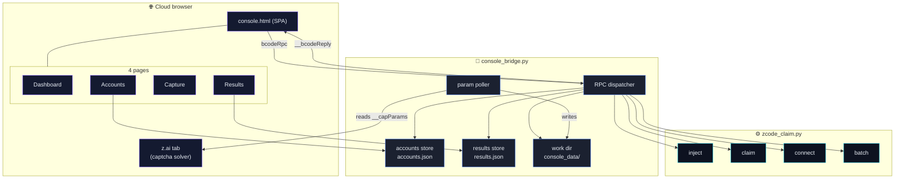
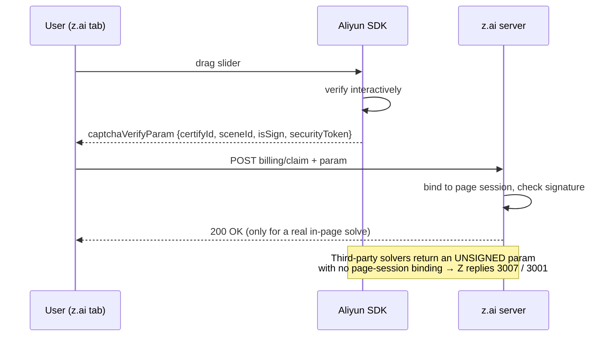

# Repository Structure

Component map of **ZCode Claim · 9Router Pipeline**. The diagram below is
Mermaid — GitHub renders it live, so it is a real diagram, not a static image.



## Web console (Level 3)

The console is a four-page SPA served into the cloud browser by the bridge. The
page and the bridge speak a tiny **request/response RPC** over the same CDP
session — the page calls `window.bcodeRpc(JSON)` and the bridge answers with
`window.__bcodeReply(id, ok, data)`. No sockets, ports or tunnels.



### RPC actions

| Action | Page | Purpose |
|--------|------|---------|
| `ping` | all | connection heartbeat (top-right dot) |
| `inject` / `claim` / `connect` | Dashboard | single stages |
| `opencaptcha` / `grabparam` | Capture | open the z.ai tab, read the captured param |
| `accounts.list/add/remove/clear/import/export` | Accounts | batch manager |
| `batch.run` | Accounts | run every account through the pipeline |
| `fs.read` / `fs.write` | Results | read/write files in the work dir |
| `results.get` | Results | last run / batch results |
| `status` | Results | jwt-file plan status |

### Screenshots

See [`docs/screenshots/`](screenshots) (dashboard, accounts, capture, results,
mobile) and the walkthrough video [`docs/demo.mp4`](demo.mp4).

## Plain-text overview

```
zcode-claim-9router/
├── assets/
│   ├── logo.svg / logo.png        the mark (glowing Z in a router ring)
│   └── banner.svg / banner.png    README header
├── docs/
│   ├── README.id.md               Bahasa Indonesia
│   ├── README.zh.md               中文
│   ├── README.ja.md               日本語
│   ├── README.es.md               Español
│   ├── screenshots/               console screenshots (png)
│   ├── demo.mp4                   console walkthrough video
│   ├── record_demo.py             regenerates demo.mp4
│   └── STRUCTURE.md               this file
├── examples/
│   ├── accounts.example.json      batch input shape
│   └── config.example.ini         console / CLI defaults
├── src/
│   ├── inject.py                  token|cookies → ZCode OAuth → JWT
│   ├── claim.py                   Aliyun Captcha 2.0 + billing/claim
│   ├── zauth.py                   z.ai coding-plan API-key minting
│   ├── connect_9router.py         register a key as a `glm` connection
│   ├── zcode_claim.py             CLI orchestrator (single / batch)
│   ├── solverify.py               Solverify Aliyun solver client
│   ├── console.html               Web UI console (4-page SPA)
│   ├── console_bridge.py          CDP bridge + RPC backend
│   └── console_data/              work dir (gitignored): accounts, results, param
├── run.sh                         one-command launcher
├── CONTRIBUTING.md
├── LICENSE
└── README.md
```

## Stage-by-stage data flow

| # | Stage | Module | Input | Output | Verified |
|---|-------|--------|-------|--------|----------|
| 1 | Inject | `inject.py` | token / cookies | ZCode JWT | ✅ |
| 2 | Claim | `claim.py` | JWT + `captchaVerifyParam` | Start Plan active | ⚠️ interactive captcha |
| 3 | Mint key | `zauth.py` | z.ai access token | coding-plan API key | ✅ |
| 4 | Connect | `connect_9router.py` | API key | `glm` connection | ✅ |

## Why the claim needs an interactive solve


